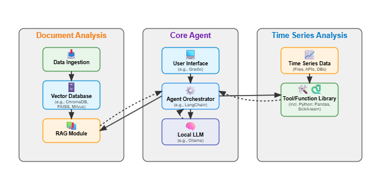
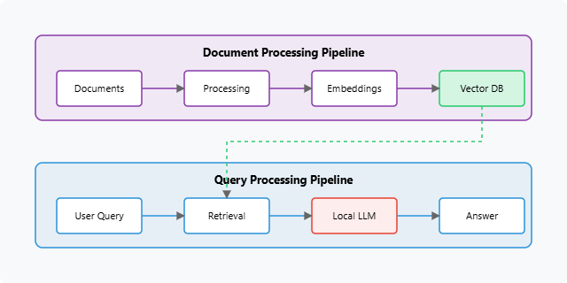
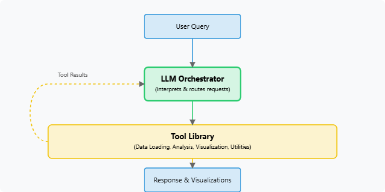

# Industrial AI Agents Architecture

This document provides an overview of the architectural design principles and core components used in the Industrial AI Agents project. It covers the high-level system architecture and the specific architectures for the Industrial Document Analysis Agent (IDOCA) and the Industrial Time Series Analysis Agent (ITISA).

## Guiding Principles

The design of these agents is guided by the following principles:

* **Local First:** Prioritize local deployment to ensure data privacy, security, and operational control, minimizing reliance on external cloud services.
* **Open Source:** Leverage open-source Large Language Models (LLMs), frameworks, and tools to foster transparency, customization, and community collaboration.
* **Modularity:** Design components to be loosely coupled, allowing for easier maintenance, upgrades, and replacement of individual parts (e.g., swapping LLMs, vector databases, or analytical tools).
* **Resource Efficiency:** Aim for practicality on modest, consumer-grade hardware, making AI accessible without requiring specialized, high-cost infrastructure.
* **Extensibility:** Build a foundational architecture that can be extended to support new data types (images, video, etc.) and more complex industrial use cases in the future.
* **Practicality & Usability:** Focus on solving real-world industrial problems with intuitive interfaces and clear documentation to lower the barrier for adoption.

## High-Level System Architecture

The overall system is designed to support multiple, specialized AI agents. Each agent interacts with a core set of local AI infrastructure while leveraging its own specific data processing pipelines and tools.

**Core Components of the Local AI Infrastructure:**

1.  **User Interface (UI):**
    * Provides the means for users to interact with the agents.
    * Implemented using Gradio for simplicity and rapid prototyping.
    * Alternative: Open WebUI for a more feature-rich chat experience with Ollama models.
2.  **Agent Orchestrator / Framework:**
    * The "brain" that manages the agent's logic, state, and control flow.
    * Interprets user input, decides on the next action (e.g., call LLM, use RAG, execute a tool).
    * **IDOCA:** Primarily uses LangChain/LangGraph for building RAG chains and agentic workflows.
    * **ITISA:** Uses a lightweight framework like `smolagents` (or could be adapted to LangChain's agent tools) for function/tool calling.
3.  **Local Large Language Model (LLM) Server:**
    * **Ollama:** Serves as the primary platform for running open-source LLMs (e.g., Llama3, Qwen2, Phi-3) and embedding models (e.g., `nomic-embed-text`) locally.
    * Provides an API endpoint (typically `http://localhost:11434`) for agents to interact with the models.
4.  **Specialized Agent Modules:**
    * Each agent has its own dedicated modules for data processing, knowledge retrieval, or tool execution.

## IDOCA (Industrial Document Analysis Agent) Architecture

IDOCA is built upon a **Retrieval-Augmented Generation (RAG)** architecture. This approach grounds the LLM's responses in factual information extracted from a provided set of industrial documents.

**Key Components & Data Flow:**

1.  **Data Ingestion & Preprocessing (Offline/On-demand):**
    * **Document Loading:** Loads various document formats (PDF, DOCX, TXT, CSV).
    * **Document Parsing:** Uses libraries like `Docling` (recommended for complex industrial PDFs to preserve structure, tables, and layout) or `Unstructured` / `PyMuPDF` for extracting text and metadata.
    * **Text Chunking:** Splits large documents into smaller, semantically coherent segments (chunks) suitable for embedding. Strategies include recursive character splitting, semantic chunking, or layout-aware chunking from Docling.
    * **Embedding Generation:** Each chunk is converted into a numerical vector representation (embedding) using a local embedding model (e.g., `nomic-embed-text` via Ollama, or Sentence Transformers like `all-MiniLM-L6-v2`).
    * **Vector Storage:** Embeddings and their corresponding text chunks (and metadata) are stored and indexed in a local vector database (e.g., `Chroma`, `FAISS`).
2.  **Querying & Generation (Online):**
    * **User Query:** The user submits a natural language question.
    * **Query Embedding:** The user's query is converted into an embedding using the same embedding model.
    * **Retrieval:** The vector database is searched to find the document chunks whose embeddings are most semantically similar to the query embedding (e.g., using cosine similarity). The top-k relevant chunks are retrieved.
    * **Context Augmentation:** The retrieved chunks are assembled into a context string.
    * **Prompt Engineering:** The original query and the retrieved context are combined into a prompt for the LLM.
    * **LLM Generation:** The prompt is sent to a local LLM (e.g., `llama3:8b`, `qwen2:7b` via Ollama). The LLM generates an answer based on the provided context and its internal knowledge.
    * **Response:** The generated answer is returned to the user.
3.  **Agentic RAG (Advanced):**
    * Uses LangGraph or a similar framework to create more complex workflows.
    * The agent can use tools (e.g., the RAG chain itself, a web search tool, a calculator) and make decisions in a loop (reason, act, observe).
    * Allows for multi-step reasoning and handling more complex queries.

**Technologies Used in IDOCA:**

* **LLMs & Embedding Models:** Served via Ollama (e.g., `nomic-embed-text`, `llama3`, `qwen2`).
* **Document Parsing:** `Docling`, `Unstructured`, `PyMuPDF`.
* **Vector Database:** `Chroma` (primary), `FAISS`.
* **Orchestration:** `LangChain`, `LangGraph`.
* **UI:** `Gradio`.

## ITISA (Industrial Time Series Analysis Agent) Architecture

ITISA employs a **function-calling (or tool-using)** architecture. The LLM acts as an orchestrator, interpreting user requests in natural language and deciding which specialized Python tools to execute to perform data analysis, visualization, or other computations.

**Key Components & Data Flow:**

1.  **User Query:** The user asks a question or gives a command in natural language related to time series data (e.g., "Plot the temperature for sensor X from last week," "Detect anomalies in pressure data").
2.  **LLM Interpretation & Tool Selection:**
    * The query is sent to a local LLM (e.g., `qwen2:7b`, `llama3:8b` via Ollama, chosen for good function-calling capabilities).
    * The LLM is provided with a list of available tools (Python functions) and their descriptions (name, purpose, parameters, and expected input/output format).
    * Based on the query and tool descriptions, the LLM decides if a tool is needed, which tool to use, and what parameters to pass to it.
3.  **Tool Execution:**
    * If the LLM decides to call a tool, it generates a structured request (e.g., a JSON object with the tool name and arguments).
    * The agent framework (e.g., `smolagents`, or LangChain's agent executor) parses this request and executes the corresponding Python function with the provided arguments.
    * The Python tool performs its task (e.g., loads data using Pandas, generates a plot using Matplotlib/Plotly, runs an anomaly detection algorithm using Scikit-learn).
4.  **Result Integration & Response Generation:**
    * The output from the executed tool (e.g., a summary string, a path to a saved image, a DataFrame) is returned to the LLM.
    * The LLM uses this output to formulate a natural language response to the user's original query. This might involve summarizing the tool's findings, confirming the action taken, or presenting the data.
    * The response, potentially including paths to generated plots or data summaries, is returned to the user via the UI.

**Tool Library for ITISA:**

The effectiveness of ITISA relies on a well-defined library of Python tools, including:

* **Data Management Tools:** Load CSV/data, describe dataset, resample data.
* **Analysis Tools:** Calculate statistics, detect anomalies (e.g., Z-score, Isolation Forest), trend/seasonality analysis (e.g., using `statsmodels`).
* **Visualization Tools:** Plot time series, plot anomalies, create correlation heatmaps (using `matplotlib`, `seaborn`, or `plotly`).
* **Utility Tools:** Unit conversion, data transformation.

**Technologies Used in ITISA:**

* **LLMs:** Served via Ollama (models with strong function-calling are preferred, e.g., `qwen2` series, fine-tuned `llama3` variants).
* **Agent Framework:** `smolagents` (as per thesis), or could be built with `LangChain` agents.
* **Data Processing:** `Pandas`, `NumPy`.
* **Analysis Libraries:** `Scikit-learn`, `Statsmodels`, `PyOD`.
* **Visualization:** `Matplotlib`, `Seaborn`, `Plotly`.
* **UI:** `Gradio`.

## Component Selection Principles Revisited

The choice of specific components (LLMs, databases, libraries) for both agents is driven by the core principles outlined earlier, with a strong emphasis on:

1.  **Local Deployability & Performance on Modest Hardware:** Can it run effectively without excessive resource demands?
2.  **Open Source Licensing:** Is it permissible for research, educational, and potentially broader use?
3.  **Ease of Integration & Use:** How straightforward is it to set up and integrate with other components?
4.  **Community Support & Maturity:** Is the component well-supported and stable?
5.  **Functionality for Industrial Tasks:** Does it provide the necessary features for the specific industrial use case?

## Data Flow Patterns Summarized

* **IDOCA (RAG):**
    `User Query -> Embed Query -> Retrieve Similar Chunks from VectorDB -> Augment LLM Prompt with Context -> LLM Generates Answer -> Response to User`
* **ITISA (Function Calling):**
    `User Query -> LLM Interprets & Selects Tool -> LLM Generates Tool Call -> System Executes Tool -> Tool Returns Result to LLM -> LLM Generates Final Response -> Response to User`

## Extensibility

The architecture is designed with extensibility in mind:

1.  **New Agent Types:** The core local AI infrastructure (Ollama, UI framework) can support additional agent types for different industrial tasks (e.g., image analysis, predictive maintenance using different techniques).
2.  **Component Substitution:** Individual components can be swapped out. For example, a different vector database could be used for IDOCA, or a different LLM could be selected for either agent via Ollama.
3.  **Tool Addition (ITISA):** New Python functions can be easily added to ITISA's tool library to expand its analytical capabilities.
4.  **Data Source Integration:** Both agents can be extended to connect to more diverse data sources (e.g., industrial databases, APIs, IoT platforms).
5.  **Advanced RAG Techniques (IDOCA):** Implement more sophisticated RAG strategies like re-ranking, query transformation, or hybrid search.
6.  **Multi-Modal Data:** Future extensions could incorporate models and tools for handling image, audio, or video data relevant to industrial settings.

## Deployment Options

While the primary focus is local deployment on a user's workstation, the architecture can be adapted for other scenarios:

1.  **Local Desktop/Workstation:** The default mode, running directly on an engineer's or operator's machine.
2.  **On-Premises Server:** Deploying the Ollama server and agent applications on a centralized server within the organization's network for shared access.
3.  **Edge Devices (Future):** With further optimization and smaller, highly efficient models, components could potentially be deployed on industrial edge devices (requires careful consideration of resource constraints).
4.  **Docker Containers:** Encapsulating agents and their dependencies in Docker containers for easier deployment, scaling, and management, especially in on-premises server environments. (Docling is already suggested to be run via Docker).

This architectural overview provides a blueprint for developing practical and extensible AI agents tailored for industrial applications, emphasizing local control and open-source technologies.
