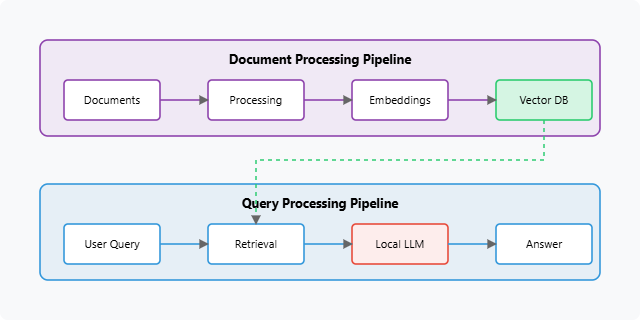

# IDOCA - Industrial Document Analysis Agent

Welcome to the documentation for IDOCA (Industrial Document Analysis Agent). IDOCA is designed to help users analyze and extract information from various industrial documents using a locally deployed Large Language Model (LLM) and a Retrieval-Augmented Generation (RAG) pipeline.

## 1. Overview

Industrial environments rely heavily on extensive documentation, including:
* Technical Manuals & Specifications
* Standard Operating Procedures (SOPs)
* Maintenance Logs & Reports
* Safety Guidelines & Compliance Documents
* Process Descriptions & Schematics

IDOCA aims to make this information more accessible by allowing users to ask natural language questions and receive answers grounded in the content of these documents. This can significantly speed up troubleshooting, information retrieval, training, and decision-making processes.

**Key Capabilities:**
* Process various document formats (PDF, DOCX, TXT, CSV, etc.).
* Utilize advanced document parsing (e.g., with Docling) to preserve structure from complex PDFs.
* Build a searchable knowledge base from your documents using vector embeddings.
* Answer questions based on the content of the indexed documents (RAG).
* Support for an agentic RAG approach, allowing for more complex queries and tool use.
* Run entirely locally using Ollama and open-source models.

## 2. Architecture

IDOCA is built on a Retrieval-Augmented Generation (RAG) architecture. For a detailed explanation, please refer to the main [Architecture Overview](../architecture.md#idoca-industrial-document-analysis-agent-architecture).

**Core Workflow:**

1.  **Document Ingestion:** Documents are uploaded, parsed (text and structure extracted), and split into manageable chunks.
2.  **Embedding & Indexing:** Each chunk is converted into a numerical vector (embedding) and stored in a local vector database (e.g., Chroma).
3.  **Querying:**
    * A user asks a question.
    * The question is embedded.
    * The vector database is searched for the most relevant document chunks.
4.  **Generation:** The retrieved chunks (context) and the original question are passed to an LLM, which generates an answer.



## 3. Setup and Installation

Before running IDOCA, ensure you have completed the general setup described in the main **[Getting Started Guide](../getting_started.md)**. This includes:
* System prerequisites met.
* Python virtual environment created and activated.
* Ollama installed and running.
* Root project dependencies installed (`pip install -r requirements.txt`).

**IDOCA-Specific Setup:**

1.  **Install IDOCA Dependencies:**
    Navigate to the repository's root directory and run:
    ```bash
    pip install -r idoca/requirements.txt
    ```
2.  **Pull Required Ollama Models:**
    * **Embedding Model:**
        ```bash
        ollama pull nomic-embed-text
        ```
    * **LLM for Generation (choose based on your hardware):**
        * Recommended for good reasoning: `ollama pull llama3:8b` or `ollama pull qwen2:7b`
        * Lighter alternative: `ollama pull phi3:mini` or `ollama pull qwen2:1.5b`
        Ensure the model selected is specified in `idoca/config.py` or selectable in the UI.
3.  **(Recommended) Setup Docling for Advanced PDF Parsing:**
    IDOCA can use `Docling` for superior parsing of complex PDFs, especially those with tables and structured layouts. The easiest way to use Docling is via its Docker container.
    * **Pull Docling Docker image:**
        ```bash
        docker pull quay.io/docling-project/docling-serve:latest
        ```
    * **Run Docling server:**
        ```bash
        docker run -d -p 5001:5001 --name docling_server quay.io/docling-project/docling-serve:latest
        ```
    IDOCA's `config.py` should have `USE_DOCLING = True` and `DOCLING_URL = "http://localhost:5001"` if you are using this method. If you don't want to use Docling, set `USE_DOCLING = False` (parsing quality for complex PDFs might be lower).
    You can also install Docling as a Python package (`pip install docling`), but the Docker method is often more straightforward.

## 4. Running IDOCA

1.  Ensure Ollama is running.
2.  If using Docling via Docker, ensure the `docling_server` container is running.
3.  Activate your Python virtual environment.
4.  Navigate to the `idoca` directory within the project:
    ```bash
    cd idoca
    ```
5.  Run the main application:
    ```bash
    python main.py
    ```
6.  Open your web browser and go to the URL displayed in the terminal (usually `http://127.0.0.1:7860`).

## 5. Usage Guide

The IDOCA Gradio interface is organized into tabs:

### Tab 1: Upload & Initialize Data

1.  **Step 1: Upload Files:**
    * Click "Select Docs & Images" to upload your industrial documents (PDFs, DOCX, TXT, CSV) and any relevant images (if image processing features are used).
2.  **Step 2: Select Models:**
    * **Embedding Model:** Choose the embedding model (e.g., `nomic-embed-text`).
    * **Vision Model (Optional):** If processing images, select a vision model.
    * **LLM (RAG & Agent):** Select the LLM to be used for generating answers.
3.  **Step 3: Process Uploaded Files:**
    * Click the "Process New Files" button.
    * IDOCA will parse the documents, chunk them, and (if applicable) process images. The "File Processing Log" will show the status.
    * An image preview and description (if vision model used) may appear.
4.  **Step 4: Initialize Systems:**
    * Click "Initialize/Re-Initialize RAG & Agent".
    * This step creates embeddings for the processed document chunks and builds the vector database. It also initializes the agentic components. This step is crucial and must be done after processing new files or changing models.
5.  **Clear Data (Optional):**
    * "Clear All Data & Session State" will remove processed data, the vector store, and reset the agent. Use this if you want to start fresh with new documents or troubleshoot.

### Tab 2: Simple RAG

This tab provides a basic RAG interface.
1.  Type your question about the uploaded and processed documents in the "Ask a question based on the processed documents..." textbox.
2.  Click "Ask".
3.  The agent will retrieve relevant context and generate an answer. The LLM's thought process or retrieved context might be displayed.

### Tab 3: Agentic RAG

This tab uses a more advanced agentic RAG system, potentially leveraging LangGraph and tools.
1.  Type your complex question or instruction in the textbox.
2.  Click "Ask Agent".
3.  The agent will engage in a multi-step reasoning process, potentially using tools (like the RAG search tool or others defined) to formulate an answer. The agent's thought process and tool usage will be displayed.

**Example Queries for IDOCA:**
(Referencing examples from your thesis Appendix C)
* "What is the maximum operational temperature for the electric arc furnace?" (Assuming relevant manual is uploaded)
* "List all personal protective equipment required in the furnace area."
* "Summarize the emergency procedures for chemical spills, including contact numbers."
* "If the cooling water temperature increases from 32°C to 38°C, is this within operational limits? What specific actions should be taken according to procedures, and what would be the potential impact on furnace operation?" (Agentic RAG might be better for this multi-part query)

## 6. Configuration

Key configuration options for IDOCA can be found in `idoca/config.py`.
You can modify:
* `DEFAULT_EMBEDDING_MODEL`, `DEFAULT_LLM_MODEL`, `DEFAULT_VISION_MODEL`
* `VECTOR_DB_PATH`: Path to store the Chroma vector database.
* `CHUNK_SIZE`, `CHUNK_OVERLAP`: Parameters for text chunking.
* `USE_DOCLING`, `DOCLING_URL`: Settings for Docling integration.
* `RAG_NUM_SOURCES_TO_RETRIEVE` (or similar): How many chunks to retrieve for context.

## 7. Customization and Extension

* **Document Parsers:** You can integrate other document parsing libraries by modifying `idoca/data_processor.py`.
* **Embedding Models/LLMs:** Easily change models by updating `config.py` and ensuring they are available in Ollama.
* **RAG Pipeline:** The RAG logic in `idoca/rag_system.py` (or similar file) can be customized (e.g., different retrievers, re-ranking strategies).
* **Agentic Tools (for Agentic RAG):** New tools can be defined and added to the LangGraph agent in `idoca/agent.py` to extend its capabilities beyond simple document search. For example, tools for unit conversion, calculations based on document data, or even web searches for supplementary information.
* **Supported File Types:** Extend `ALLOWED_EXTENSIONS` in `idoca/interface.py` (or `main.py`) and add corresponding processing logic in `data_processor.py`.

## 8. Troubleshooting

Refer to the main **[Troubleshooting Guide](../troubleshooting.md)** for general issues.
IDOCA-specific tips:
* **"Agent N/A" or no response:** Ensure you have (1) Uploaded files, (2) Processed files, AND (3) Initialized Systems in the UI.
* **Poor quality answers:**
    * Try a more capable LLM.
    * Adjust chunking parameters (`CHUNK_SIZE`, `CHUNK_OVERLAP`).
    * Ensure Docling is used for complex PDFs if possible.
    * Check if the documents actually contain the information.
* **Slow processing/responses:**
    * Use smaller LLMs.
    * Process fewer documents at a time.
    * Ensure your hardware meets recommendations.
* **Docling errors:** Make sure the Docling Docker container is running and accessible on the configured URL (usually `http://localhost:5001`).

For further details on the underlying implementation, refer to the source code in the `idoca/` directory.
